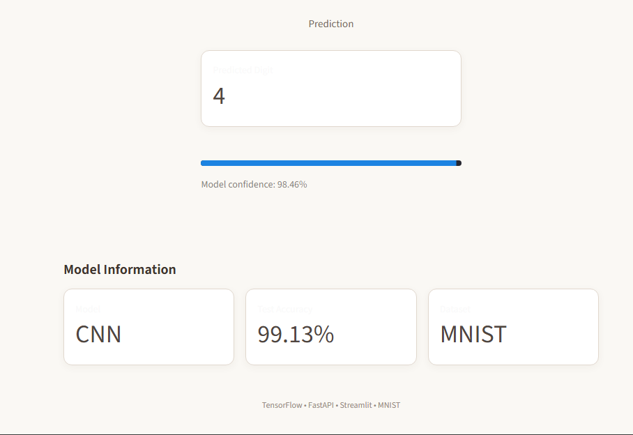

# 🧠 MNIST Digit Recognition API

### End-to-end handwritten digit recognition with TensorFlow, FastAPI, Streamlit & Docker

[](https://www.python.org/)
[](https://www.tensorflow.org/)
[](https://fastapi.tiangolo.com/)
[](https://streamlit.io/)
[](https://www.docker.com/)
[](#-testing)
[](https://render.com/)

A complete machine learning application that recognizes handwritten digits using a CNN trained on **MNIST**.

Users can **draw a digit or upload an image** through a Streamlit interface. The image is sent to a **FastAPI REST API**, where it is preprocessed and classified by the trained TensorFlow/Keras CNN.

The complete application is containerized with **Docker** and can be run locally with **Docker Compose**. The backend and frontend are publicly deployed on **Render**.

---

## 🚀 Live Demo

**🌐 Frontend:** https://mnist-digit-frontend-9r4z.onrender.com

**⚡ FastAPI Backend:** https://mnist-digit-recognition-api.onrender.com

**📖 Swagger API Docs:** https://mnist-digit-recognition-api.onrender.com/docs

> The Render free tier may spin services down after inactivity, so the first request can take a little longer while the service wakes up.

---

# 📸 Screenshots

## Streamlit Interface

Users can draw a handwritten digit or upload an image.


## Digit Prediction

The application displays the predicted digit and model confidence.


## Model Information

The frontend displays model type, test accuracy, dataset and confidence.



## FastAPI Swagger Documentation

Interactive API documentation for the backend.


---

# 🏗️ Architecture

```text
User
 │
 ▼
Streamlit Frontend :8501
 │
 │ HTTP
 ▼
FastAPI REST API :8000
 │
 ▼
Image Preprocessing
 │
 ├─ Grayscale
 ├─ Background Detection
 ├─ Digit Extraction
 ├─ Crop + Margin
 ├─ Resize
 ├─ Center
 └─ Normalize
 │
 ▼
TensorFlow / Keras CNN
 │
 ▼
Prediction + Confidence
```

---

# 🧠 Machine Learning Model

The classifier is a convolutional neural network trained on the **MNIST handwritten digit dataset**.

## Architecture

```text
Input: 28 × 28 × 1
        │
        ▼
Conv2D — 32 filters — 3×3 — ReLU
        │
        ▼
MaxPooling — 2×2
        │
        ▼
Conv2D — 32 filters — 3×3 — ReLU
        │
        ▼
MaxPooling — 2×2
        │
        ▼
Flatten
        │
        ▼
Dense — 128 — ReLU
        │
        ▼
Dense — 10 — Softmax
        │
        ▼
Digit 0–9
```

## Performance

| Metric | Result |
|---|---:|
| Training samples | 55,000 |
| Validation samples | 5,000 |
| Test samples | 10,000 |
| Total parameters | 113,386 |
| Test Accuracy | **99.13%** |

Model file:

```text
Model/mnist_cnn.keras
```

---

# 🔧 Image Preprocessing

Real-world handwritten images are not always positioned like MNIST samples.

```text
Input Image
     ↓
Grayscale
     ↓
Background Detection
     ↓
Digit Extraction
     ↓
Bounding Box
     ↓
Crop + Margin
     ↓
Resize
     ↓
Center Digit
     ↓
Normalize
     ↓
28 × 28 × 1
     ↓
CNN
```

This pipeline supports both **uploaded images** and **digits drawn directly in the frontend**.

---

# ⚡ REST API

| Method | Endpoint | Purpose |
|---|---|---|
| `GET` | `/` | API information |
| `GET` | `/health` | Health check |
| `GET` | `/model-info` | Model information |
| `POST` | `/predict` | Predict handwritten digit |

### Example response

```json
{
  "prediction": 9,
  "confidence": 99.13,
  "filename": "digit.png"
}
```

Interactive documentation:

https://mnist-digit-recognition-api.onrender.com/docs

---

# 🎨 Frontend

The Streamlit application provides:

- ✍️ Draw Digit
- 📤 Upload Image
- 🔢 Predicted digit
- 📊 Model confidence
- 🧠 Model information
- 🎯 Test accuracy

The frontend communicates with the backend through the `API_URL` environment variable.

---

# 🧪 Testing

The API includes automated tests using **Pytest**.

```text
✓ Root endpoint
✓ Health endpoint
✓ Model information
✓ Prediction endpoint
✓ Invalid file handling

5 passed
```

Run:

```bash
python -m pytest -v
```

---

# 🐳 Docker

Start the complete application:

```bash
docker compose up --build
```

Local URLs:

```text
Frontend:  http://127.0.0.1:8501
FastAPI:   http://127.0.0.1:8001
Swagger:   http://127.0.0.1:8001/docs
```

Stop:

```bash
docker compose down
```

---

# 💻 Run Locally

## Clone

```bash
git clone https://github.com/NAVEEN8103/mnist-digit-recognition-api.git
cd mnist-digit-recognition-api
```

## Create virtual environment

Windows:

```powershell
python -m venv venv
venv\Scriptsctivate
```

## Install dependencies

```bash
pip install -r requirements.txt
```

## Start FastAPI

```bash
uvicorn api.main:app --reload
```

## Start Streamlit

Open another terminal:

```bash
streamlit run frontend/app.py
```

---

# ☁️ Deployment

The application is deployed as two Render web services.

```text
GitHub Repository
       │
       ├───────────────┐
       ▼               ▼
FastAPI Backend   Streamlit Frontend
       │               │
       └────── HTTP ───┘
```

### Backend

https://mnist-digit-recognition-api.onrender.com

### Frontend

https://mnist-digit-frontend-9r4z.onrender.com

Frontend environment variable:

```text
API_URL=https://mnist-digit-recognition-api.onrender.com
```

---

# 📁 Project Structure

```text
mnist-digit-recognition-api/
│
├── api/
│   ├── __init__.py
│   ├── main.py
│   ├── model_loader.py
│   └── preprocessing.py
│
├── Model/
│   └── mnist_cnn.keras
│
├── Training/
│   └── MNIST_CNN.ipynb
│
├── frontend/
│   ├── app.py
│   ├── Dockerfile
│   └── requirements.txt
│
├── tests/
│   └── test_api.py
│
├── docs/
│   ├── streamlit-home.png
│   ├── prediction.png
│   ├── model-info.png
│   └── swagger-api.png
│
├── .streamlit/
│   └── config.toml
│
├── Dockerfile
├── docker-compose.yml
├── .dockerignore
├── .gitignore
├── requirements.txt
└── README.md
```

---

# 🛠️ Tech Stack

| Category | Technology |
|---|---|
| Language | Python |
| Machine Learning | TensorFlow / Keras |
| Model | Convolutional Neural Network |
| Dataset | MNIST |
| API | FastAPI |
| Server | Uvicorn |
| Frontend | Streamlit |
| Image Processing | Pillow / NumPy |
| Testing | Pytest |
| Containerization | Docker |
| Orchestration | Docker Compose |
| Deployment | Render |
| Version Control | Git / GitHub |

---

# 📊 What This Project Demonstrates

```text
Machine Learning
      ↓
CNN Training
      ↓
Model Evaluation
      ↓
Model Serialization
      ↓
Image Preprocessing
      ↓
REST API
      ↓
Interactive UI
      ↓
Automated Testing
      ↓
Docker
      ↓
Docker Compose
      ↓
Cloud Deployment
```

This project demonstrates practical experience across **machine learning, deep learning, API development, frontend integration, testing, containerization, and deployment**.

---

# 🔮 Future Improvements

- CI/CD with GitHub Actions
- Model versioning
- API authentication
- Prediction history
- Monitoring and logging
- Batch prediction
- Improved robustness for non-MNIST handwriting
- Additional model evaluation visualizations

---

# 👨‍💻 Author

**Naveen Tiwari**

Built as an end-to-end machine learning engineering project.

---

## 🔗 Project Links

**GitHub:**  
https://github.com/NAVEEN8103/mnist-digit-recognition-api

**Live Demo:**  
https://mnist-digit-frontend-9r4z.onrender.com

**API:**  
https://mnist-digit-recognition-api.onrender.com

**Swagger Docs:**  
https://mnist-digit-recognition-api.onrender.com/docs
