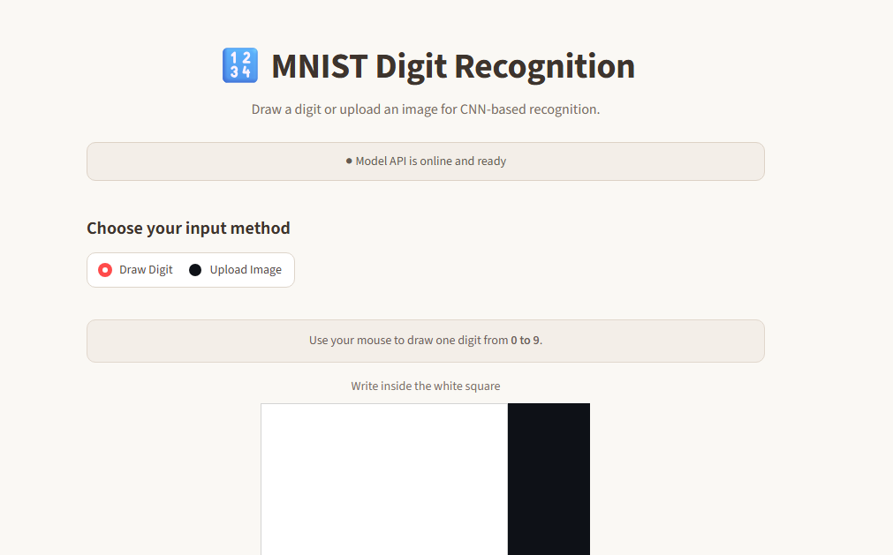
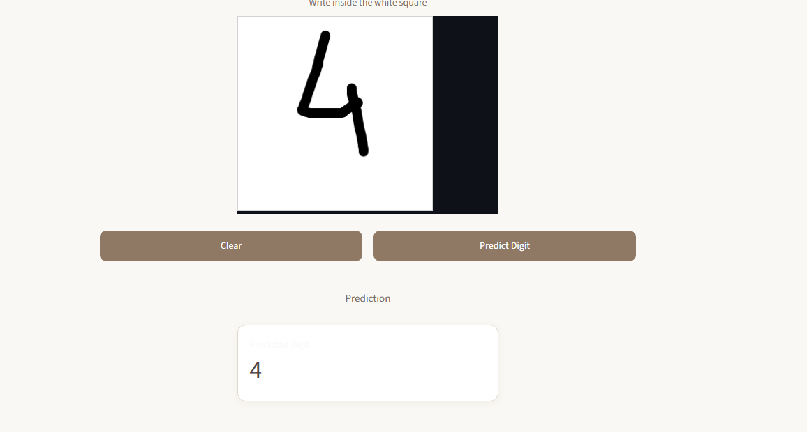
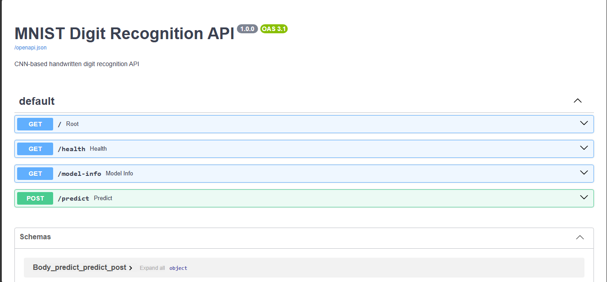

# 🧠 MNIST Digit Recognition API

### End-to-end handwritten digit recognition with TensorFlow, FastAPI, Streamlit & Docker

[](https://www.python.org/)
[](https://www.tensorflow.org/)
[](https://fastapi.tiangolo.com/)
[](https://streamlit.io/)
[](https://www.docker.com/)
[](#testing)

A complete machine learning application that recognizes handwritten digits using a CNN trained on **MNIST**.

Users can **draw a digit or upload an image**, while the trained model performs preprocessing and inference through a **FastAPI REST API**. The entire application can also be run using **Docker Compose**.

---

## ✨ Demo

### Draw a digit

Users can draw a handwritten digit directly in the Streamlit interface.

### Upload an image

Users can also upload an image containing a handwritten digit.

### Prediction

The application returns:

```text
Predicted Digit: 9
Confidence: 99.13%
```

> 📸 **Screenshots**

Add your actual screenshots here:

```text
docs/
├── streamlit-home.png
├── prediction.png
└── swagger-api.png
```

Then use:

```markdown





```

---

# 🏗️ Architecture

```text
                    ┌──────────────────┐
                    │      User        │
                    └────────┬─────────┘
                             │
                             ▼
                  ┌─────────────────────┐
                  │ Streamlit Frontend  │
                  │      :8501          │
                  └──────────┬──────────┘
                             │
                             │ HTTP
                             ▼
                  ┌─────────────────────┐
                  │    FastAPI API      │
                  │      :8000          │
                  └──────────┬──────────┘
                             │
                             ▼
                  ┌─────────────────────┐
                  │ Image Preprocessing │
                  │                     │
                  │ • Grayscale         │
                  │ • Crop              │
                  │ • Resize            │
                  │ • Center            │
                  │ • Normalize         │
                  └──────────┬──────────┘
                             │
                             ▼
                  ┌─────────────────────┐
                  │      CNN Model      │
                  │   TensorFlow/Keras  │
                  └──────────┬──────────┘
                             │
                             ▼
                  ┌─────────────────────┐
                  │ Prediction +        │
                  │ Confidence          │
                  └─────────────────────┘
```

---

# 🧠 Model

The classifier is a convolutional neural network trained on the **MNIST handwritten digit dataset**.

### Architecture

```text
Input: 28 × 28 × 1
        │
        ▼
Conv2D — 32 filters — 3×3 — ReLU
        │
        ▼
MaxPooling — 2×2
        │
        ▼
Conv2D — 32 filters — 3×3 — ReLU
        │
        ▼
MaxPooling — 2×2
        │
        ▼
Flatten
        │
        ▼
Dense — 128 — ReLU
        │
        ▼
Dense — 10 — Softmax
        │
        ▼
Digit 0–9
```

### Performance

| Metric | Result |
|---|---:|
| Training samples | 55,000 |
| Validation samples | 5,000 |
| Test samples | 10,000 |
| Parameters | 113,386 |
| Test Accuracy | **99.13%** |

The trained model is saved as:

```text
Model/mnist_cnn.keras
```

---

# 🔧 Image Preprocessing

Real handwritten images don't always have the same positioning as MNIST images.

The API therefore performs preprocessing before inference:

```text
Input Image
     ↓
Grayscale
     ↓
Background Detection
     ↓
Digit Extraction
     ↓
Bounding Box
     ↓
Crop + Margin
     ↓
Resize
     ↓
Center Digit
     ↓
Normalize
     ↓
28 × 28 × 1
     ↓
CNN
```

This allows the model to work with both **uploaded images and digits drawn in the frontend**.

---

# ⚡ REST API

The FastAPI backend exposes three main information endpoints and one prediction endpoint.

| Method | Endpoint | Purpose |
|---|---|---|
| `GET` | `/` | API information |
| `GET` | `/health` | Health check |
| `GET` | `/model-info` | Model information |
| `POST` | `/predict` | Predict handwritten digit |

### Example prediction

**Request**

```http
POST /predict
```

**Response**

```json
{
  "prediction": 9,
  "confidence": 99.13,
  "filename": "digit.png"
}
```

Interactive API documentation:

```text
http://127.0.0.1:8001/docs
```

---

# 🎨 Frontend

The Streamlit frontend provides two input methods:

### ✍️ Draw

Draw a digit directly on the canvas using your mouse.

### 📤 Upload

Upload an image containing a handwritten digit.

The frontend sends the image to the FastAPI backend and displays the prediction and confidence.

---

# 🧪 Testing

The API includes automated tests using **Pytest**.

Current test suite:

```text
✓ Root endpoint
✓ Health endpoint
✓ Model information
✓ Prediction endpoint
✓ Invalid file handling

5 passed
```

Run:

```bash
python -m pytest -v
```

---

# 🐳 Run with Docker

The application is fully containerized.

### Start everything

```bash
docker compose up --build
```

### Open the application

**Frontend**

```text
http://127.0.0.1:8501
```

**FastAPI**

```text
http://127.0.0.1:8001
```

**Swagger API**

```text
http://127.0.0.1:8001/docs
```

### Stop containers

```bash
docker compose down
```

---

# 💻 Run Locally

### 1. Clone

```bash
git clone https://github.com/NAVEEN8103/mnist-digit-recognition-api.git

cd mnist-digit-recognition-api
```

### 2. Create virtual environment

Windows:

```powershell
python -m venv venv
venv\Scripts\activate
```

### 3. Install dependencies

```bash
pip install -r requirements.txt
```

### 4. Start FastAPI

```bash
uvicorn api.main:app --reload
```

### 5. Start Streamlit

Open another terminal:

```bash
streamlit run frontend/app.py
```

---

# 📁 Project Structure

```text
mnist-digit-recognition-api/
│
├── api/
│   ├── __init__.py
│   ├── main.py
│   ├── model_loader.py
│   └── preprocessing.py
│
├── Model/
│   └── mnist_cnn.keras
│
├── Training/
│   └── MNIST_CNN.ipynb
│
├── frontend/
│   ├── app.py
│   ├── Dockerfile
│   └── requirements.txt
│
├── tests/
│   └── test_api.py
│
├── .streamlit/
│   └── config.toml
│
├── Dockerfile
├── docker-compose.yml
├── .dockerignore
├── .gitignore
├── requirements.txt
└── README.md
```

---

# 🛠️ Tech Stack

| Category | Technology |
|---|---|
| Language | Python |
| ML | TensorFlow / Keras |
| Model | CNN |
| Dataset | MNIST |
| API | FastAPI |
| Server | Uvicorn |
| Frontend | Streamlit |
| Image Processing | Pillow / NumPy |
| Testing | Pytest |
| Containerization | Docker |
| Orchestration | Docker Compose |

---

# 📈 What This Project Demonstrates

This project covers the complete path from a trained ML model to a usable application:

```text
Machine Learning
      ↓
Model Evaluation
      ↓
Model Serialization
      ↓
Image Preprocessing
      ↓
REST API
      ↓
Interactive UI
      ↓
Automated Testing
      ↓
Docker
      ↓
Docker Compose
```

It demonstrates practical experience across **ML engineering, API development, frontend integration, testing, and containerization**.

---

# 🔮 Future Improvements

- Cloud deployment
- CI/CD with GitHub Actions
- Model versioning
- API authentication
- Prediction history
- Monitoring and logging
- Batch prediction
- Improved robustness for non-MNIST handwriting

---

## 👨‍💻 Author

**Naveen Tiwari**

Built as an end-to-end machine learning engineering project.
